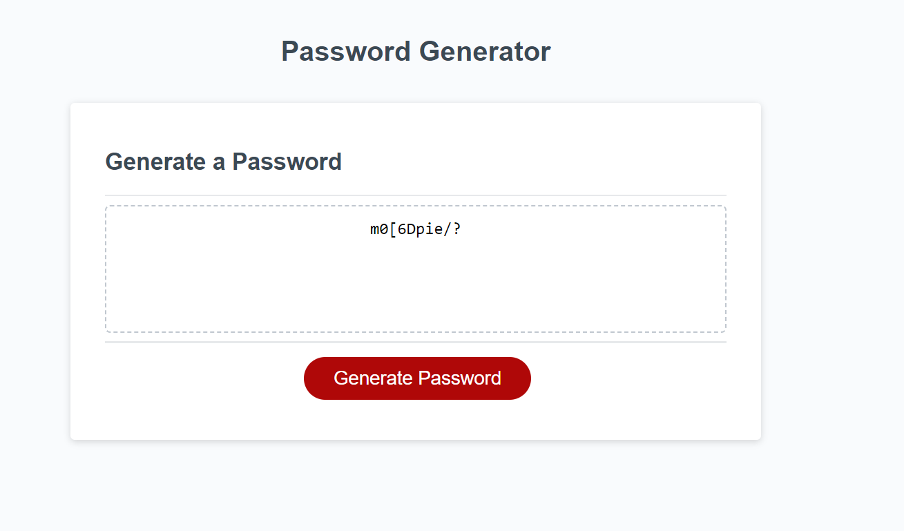

# Console-Finances

## Description

This project is to demonstrate my use of JavaScript to create a password generator, it will prompt the user for various information such as password length and what character they wish the password to contain. It will alert if the user does the input wrong.

## Table of Contents

* [Installation](#installation)
* [Usage](#usage)
* [License](#license)

## Installation

Visit URL: https://symoxn7.github.io/password-generator/

## Usage 

Click the "Generate Password" button - Input the desired password length, confirm if you want uppercase, lowercase, numbers or special characters. The generated password will then appear in the box to be copied. 

Screenshot of functionality:

## License

MIT License

Copyright (c) 2023 Symox

Permission is hereby granted, free of charge, to any person obtaining a copy
of this software and associated documentation files (the "Software"), to deal
in the Software without restriction, including without limitation the rights
to use, copy, modify, merge, publish, distribute, sublicense, and/or sell
copies of the Software, and to permit persons to whom the Software is
furnished to do so, subject to the following conditions:

The above copyright notice and this permission notice shall be included in all
copies or substantial portions of the Software.

THE SOFTWARE IS PROVIDED "AS IS", WITHOUT WARRANTY OF ANY KIND, EXPRESS OR
IMPLIED, INCLUDING BUT NOT LIMITED TO THE WARRANTIES OF MERCHANTABILITY,
FITNESS FOR A PARTICULAR PURPOSE AND NONINFRINGEMENT. IN NO EVENT SHALL THE
AUTHORS OR COPYRIGHT HOLDERS BE LIABLE FOR ANY CLAIM, DAMAGES OR OTHER
LIABILITY, WHETHER IN AN ACTION OF CONTRACT, TORT OR OTHERWISE, ARISING FROM,
OUT OF OR IN CONNECTION WITH THE SOFTWARE OR THE USE OR OTHER DEALINGS IN THE
SOFTWARE.
